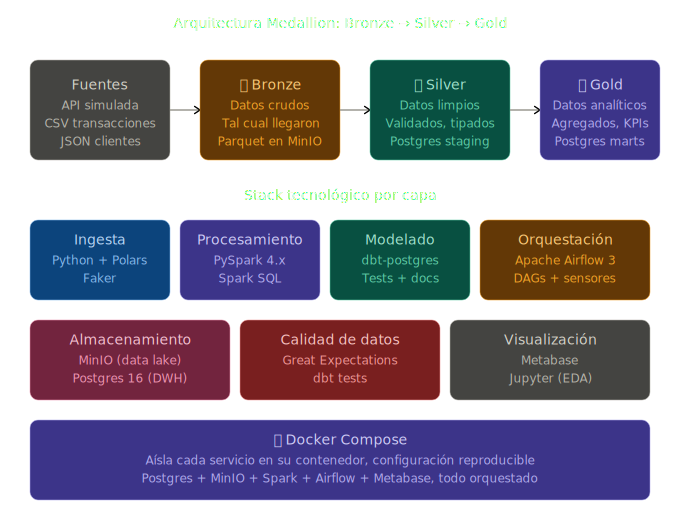
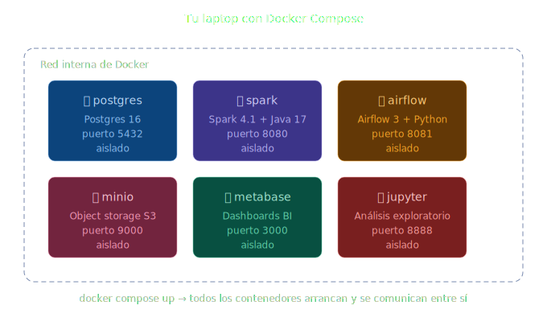
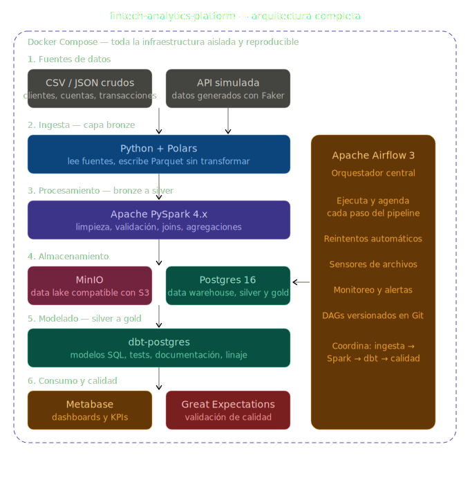

## Architecture

### Layers

#### Bronce (Crudo)

Datos crudos, los datos llegan tal cual de la fuente. Sin tocar, sin limpiar. Porque si algo sale mal en una transformación, se puede volver al origen sin tener que re-ingerir desde la fuente externa.

#### Plata (Limpio)

Se inicia la **limpieza**, **validación de tipos**, **deduplicación** y **joins simples**. Es el "almacén de datos simples".

#### Oro (Analítico)

Datos **agregados** listos para **dashboards** y **modelos**. Vistas específicas para casos de negocio (**KPIs de fraude**, **churn**, **segmentación**).

#### Importancia

Sin esta separación por capas, se tendría un conjunto de tablas donde no se sabría qué se puede confiar, qué se ha modificado y, si algo se rompe en producción, no se puede determinar/rastrear de dónde surgió el error.

## Architecture diagram

<p align="center">
  
</p>

<p align="center"><em>Figura 1. Diagrama de las etapas y herramientas a utilizar para la arquitectura.</em></p>

#### Concepto a considerar

Dentro de la red de **Docker**, cada contenedor se llama por su **nombre de servicio**. Cuando **Airflow** quiere conectarse a **Postgres**, no usa `localhost:5432`, usa `postgres:5432` (el nombre del servicio). Esto se llama **service discovery** y es fundamental entenderlo.

## Fundamental concepts

### Concepto fundamental 1: ¿Por qué Docker y Docker Compose?

#### Docker

**Docker** permitirá meter cada servicio en un **contenedor aislado**: una mini-máquina virtual ligera con su propio sistema operativo, sus propias dependencias y sus propios puertos.

#### Docker Compose

**Docker** levanta un contenedor a la vez. Para este proyecto se requiere de **5 servicios** trabajando juntos. **Docker Compose** es un archivo **YAML** donde se definen todos los servicios, sus conexiones y configuraciones, y con un solo comando se levanta todo el ecosistema.

<p align="center">
  
</p>

<p align="center"><em>Figura 2. <code>docker compose up</code> → todos los contenedores arrancan y se comunican entre sí.</em></p>

### Concepto fundamental 2: ¿Qué es una SparkSession y por qué existe?

Una **SparkSession** es el **punto de entrada** a Spark, similar a una conexión a una base de datos. Es lo primero que se crea siempre.

##### Anatomía de una SparkSession

```python
from pyspark.sql import SparkSession

spark = (
    SparkSession.builder
    .appName("FintechAnalytics")
    .master("spark://spark-master:7077")
    .config("spark.executor.memory", "2g")
    .config("spark.executor.cores", "2")
    .config("spark.sql.adaptive.enabled", "true")
    .config("spark.jars.packages", "org.postgresql:postgresql:42.7.3")
    .getOrCreate()
)
```

- **`SparkSession.builder`**: patrón de diseño "Builder". Construye la sesión paso a paso antes de instanciarla.
- **`.appName("FintechAnalytics")`**: nombre que aparecerá en la **Spark UI**. Útil cuando se tienen varios jobs corriendo simultáneamente y se necesita identificarlos en el monitor.
- **`.master("spark://spark-master:7077")`**: le dice a Spark dónde correr.
  - `"local[*]"` = usa todos los núcleos de la laptop, sin clúster.
  - `"spark://host:7077"` = conecta a un clúster Spark standalone.
  - `"yarn"` = ejecuta sobre Hadoop YARN.
  - `"k8s://..."` = ejecuta en Kubernetes.
- **`.config("spark.executor.memory", "2g")`**: cuánta RAM puede utilizar cada executor (cada worker). Si se coloca poco, los jobs grandes fallarán con `OutOfMemoryError`. Si se coloca mucho, se desperdicia recurso del clúster.
- **`.config("spark.executor.cores", "2")`**: cuántos núcleos de CPU usa cada executor. Más núcleos = más paralelismo, pero también más contención.
- **`.config("spark.sql.adaptive.enabled", "true")`**: activa el **Adaptive Query Execution (AQE)**. Spark optimiza las consultas en tiempo de ejecución basándose en estadísticas reales, no solo en el plan inicial. Activar siempre en Spark 3+.
- **`.config("spark.jars.packages", "...")`**: librerías externas que Spark debe descargar. En este caso, se carga el **driver JDBC de Postgres** para poder escribir a la base de datos.
- **`.getOrCreate()`**: si ya existe una sesión en este proceso, se reutiliza. Si no, la crea. Evita errores al ejecutar el mismo script varias veces.

#### Importancia

La configuración básica de Spark (`SparkSession.builder.getOrCreate()`), sin configuración adicional, funcionará bien en local, pero no escalará en producción. Configurar bien la sesión marca la diferencia entre un job que tarda 5 minutos y uno que tarda 5 horas.

### Concepto fundamental 3: Transformaciones vs. Acciones (lazy evaluation)

Spark divide todas las operaciones en dos tipos:

##### Transformaciones (lazy)

Cuando se escribe `.filter()`, `.select()`, `.json()`, Spark **NO ejecuta nada**. Solo construye un plan. Es como escribir una receta sin cocinar.

```python
df = spark.read.csv("ventas.csv")                        # No lee aún
df_filtrado = df.filter(df.monto > 100)                  # No filtra aún
df_agregado = df_filtrado.groupBy("categoria").sum()     # No agrupa aún
# Por ahora, Spark no ha tocado ningún dato
```

##### Acciones (eager)

Cuando se llama a `.show()`, `.count()`, `.collect()`, `.write()`, Spark **ejecuta todo el plan acumulado**.

```python
df_agregado.show()  # Ahora Spark lee, filtra, agrupa y muestra
```

#### ¿Por qué importa?

1. **Optimización**: Spark ve todo el plan junto y lo optimiza (reorganiza filtros, elimina columnas innecesarias, etc.).
2. **Eficiencia**: si se filtra y luego se seleccionan solo 2 columnas, Spark solo lee esas 2 columnas del disco.
3. **Bug común**: si se llama `.show()` 3 veces, Spark ejecuta todo 3 veces. Por ello existe `.cache()`.

```python
df_pesado = spark.read.csv("100gb.csv").filter(...).join(...)
df_pesado.cache()    # Guarda el resultado en memoria

df_pesado.show()     # Primera vez: ejecuta y cachea
df_pesado.count()    # Segunda vez: usa cache, instantáneo
```

### Concepto fundamenta 4: Por que usar MinIO en lugar de archivos locales?
MinIO es un object storage compatible con S3 de AWS, pero corre localmente. Por que agregarlo al proyecto si se tienen archivos locales?

##### Razon profesional
en la vida real, los datos no viven en data/raw/archivo.csv. Viven en S3, Azure Blob o Google Cloud Storage. Se espera que el pipeline lea de un object storage real

MinIO permite practicar como si fuera S3 sin pagar AWS. El mismo codigo que funciona contra MinIO funciona contra S3 cambiando solo la URL de configuracion.

Con esto, se trata de "llevarlo" a la vida real simulando los servicios o conexiones necesarias en la nube, utilizando un servicio local para evitar gastos.

### Concepto fundamenta 5: Por que Airflow y no solo scripts de cron?
Cron ejecuta **`python script.py`** a las 6 AM Listo. Para que hacerlo en Airflow

Airflow resuelve los siguietes problemas:
- **Dependencias entre tareas:** *Ejecuta una extraccion, luego transformacion, luego validacion, luego carga.* Si una falla, las siguientes no deben correr. Cron no maneja esto.
- **Reintentos automaticos:** Si la API externa falla, Airflow puede reintentar 3 veces con backoff exponencial.
- **Backfilling:** Si el pipeline estuvo roto 3 dias, Airflow puede *rellenar* los dias faltantes con un comando.
- **Observabilidad:** Una UI que te muestra que tarea fallo, cuando, con que error, cuanto tardo. Cron solo envia un email cuando falla.
- **Sensores:** *Espera hasta que el archivo X aparezca en S3, entonces ejecuta.* Cron no puede hacer esto.
- **SLA y alertas:** *Si esta tarea tarda mas de 3 minutos, alertame en slack*

**El concepto clave de Airflow es el DAG** (Directed Acyclic Graph): Un grafo de tareas con dependencias. No es un script lineal, es una red de tareas.

### Concepto fundamental 6: Por que dbt si ya tenemos Spark SQL?
Si Spark transforma datos, dbt tambien, no seria redundante?
**No**, hacen cosas distintas y son **complementarios:**

**Spark hace el *trabajo pesado*:** Lee CSV/JSON gigantes, hace joins distribuidos en TB de datos, procesa streaming, ejecuta ML. Es para **datos crudos y grandes volumenes.**

**dbt hace el *modelado analitico*:** ya que los datos estan limpios en Postgres, dbt los modela en tablas analiticas con SQL puro. Pero agrega cosas que Spark no tiene:
- **Linaje automatico:** dbt sabe que modelo depende de cual y dibuja el grafo.
- **Tests declarativos:** *Esta columna no debe tener nulos*, *esta clave debe ser unica*
- **Documentacion generada:** dbt genera un sitio web con la definicion de cada columna
- **Macros reutilizables:** Logica SQL parametrizada que evita repeticion
- **Versionado de modelos:** cada modelo es un archivo Git

**Regla mental:**
- Si los datos estan en CSVs/JSONs/Parquet y son grandes → **Spark**
- Si los datos ya estan en un warehouse (Postgres/Snowflake/BigQuery) → **dbt**

## Project structure

```text
fintech-analytics-platform/
├── README.md                    # Documentación del proyecto
├── pyproject.toml               # Dependencias gestionadas por uv
├── .env.example                 # Variables de entorno de ejemplo
├── .gitignore                   # Lo que Git debe ignorar
│
├── docker/                      # Configuración de cada servicio
│   ├── docker-compose.yml       # Orquestación principal
│   ├── airflow/
│   │   ├── Dockerfile
│   │   └── requirements.txt
│   ├── spark/
│   │   └── Dockerfile
│   └── postgres/
│       └── init.sql             # Schemas iniciales
│
├── data/
│   ├── raw/                     # CSVs/JSONs de entrada
│   ├── bronze/                  # Capa cruda en Parquet
│   └── generators/
│       └── generate_data.py     # Genera datos sintéticos
│
├── src/                         # Código Python del proyecto
│   ├── ingestion/               # Scripts de ingesta
│   │   └── ingest_to_bronze.py
│   ├── processing/              # Jobs de Spark
│   │   ├── bronze_to_silver.py
│   │   └── silver_aggregations.py
│   └── utils/                   # Funciones compartidas
│       ├── spark_session.py     # Builder de SparkSession
│       └── config.py            # Configuración centralizada
│
├── dbt_fintech/                 # Proyecto dbt
│   ├── dbt_project.yml
│   ├── profiles.yml
│   ├── models/
│   │   ├── staging/             # Modelos de capa silver
│   │   ├── intermediate/        # Joins y lógica reutilizable
│   │   └── marts/               # Capa gold (analítica)
│   │       ├── finance/
│   │       └── fraud/
│   ├── tests/                   # Tests personalizados
│   ├── macros/                  # Lógica reutilizable
│   └── seeds/                   # Datos de referencia (países, etc.)
│
├── dags/                        # DAGs de Airflow
│   ├── fintech_daily_pipeline.py
│   └── fintech_fraud_detection.py
│
├── tests/                       # Tests Python (pytest)
│   ├── test_processing.py
│   └── test_data_quality.py
│
└── notebooks/                   # Análisis exploratorio
    └── eda_transactions.ipynb
```

### Por que cada carpeta?
- **`docker/`:** Separa la infraestructura del codigo. Si se cambia de Postgres a MySQL, solamente se toca esta carpeta
- **`src/`:** convencion de python moderna. Separa codigo fuente de configuracion y datos. Permite
empaquetar el proyecto como libreria instalable.
- **`src/utils`:** Aqui va codigo **reutilizable entre scripts**. La funcion **`build_spark_session()`** se utiliza en multiples jobs
- **`dbt_fintech/models/staging|intermediate|marts/`:** refleja la aquitectura medallion. Convencion oficial de dbt.
- **`dags/`:** Airflow espera encontrar DAG en una carpeta especifica. Carpeta separada para que sea obvio
- **`tests/`:** Tests automatizados. **Esto es lo que diferencia entre proyectos** Se debe tener tests para evitar problemas a futuro.
- **`notebooks/`:** para exploracion, NO para produccion. Convencion clara: notebooks no se ejecutan en el pipline.

### Modelo de dato del proyecto
##### Tablas fuente:
- **`clientes`:** Informacion de titular (id, nombre, pais, fecha registro, segmeto)
- **`cuentas`:** Cuentas bancarias asociadas al cliente (id, tipo, moneda, saldo inicial)
- **`transacciones`:** movimientos (id, cuenta, monto, tipo, comercio, ubicacion, timestamp)

##### Metricas analiticas (capa oro):
- Transacciones diarias por pias y segmento por cliente
- **Score de fraude por cliente:** Transacciones inusuales (montos rapidos, ubicaciones lejanas, frecuencia anormal)
- Tasa de retencion por volumen
- Cuentas inactivas (sin movimientos en 30+ dias)

Esto es lo que se desea realizar para poder poner en pracica conocimientos basicos de ciertas tecnologias, como tambien, aprender muchas otras y reforzar las ya conocidas.


<p align="center">
  
</p>

<p align="center"><em>Figura 3. Diagrama de la arquitectura del proyecto.</em></p>